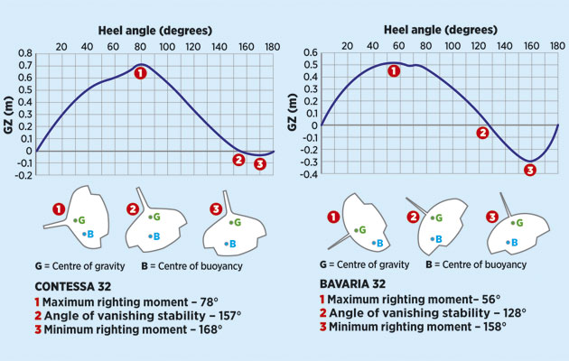

[→ Lucy's position]( "Link title")

## Contessa 32 'Lucy' – A Sailing Yacht with Charm and Tradition

The **Contessa 32**, designed by David Sadler and built by Jeremy Rogers Ltd, strikes a balance between classic long keel boats and modern fin keel boats. Its semi-long keel with skeg design, inspired by the Contessa 26, offers efficient upwind performance and exceptional seaworthiness. The Contessa 32, renowned for its stability and practical interior layout, is a popular choice for sailors prioritizing comfort and performance at sea.

> If it looks right, it possibly is right



## The Contessa 32 – A Legendary Design

The **Contessa 32** was designed in the 1960s by the British designer **David Sadler** and built by **Jeremy Rogers Ltd**. It is distinguished by its sturdy construction and excellent sailing characteristics, making it ideal for both regattas and long, leisurely passages on the open sea. Measuring 9.75 metres in length and 2.50 metres in beam, it is a popular mid-sized yacht, admired for its stable hull shape and longevity.

More information about the **Contessa 32** and its history can be found at [Contessa 32 New Build](https://www.jeremyrogers.co.uk/contessa-32-new-build/), the official website of Jeremy Rogers Limited.

The Contessa 32 is a true masterpiece of engineering, offering safety and speed at sea. Its strong hull makes it perfect for rougher waters and ensures reliable performance even under challenging conditions.

*Jeremy Rogers sailing Calypso*

## Lucy – A Sailing Yacht with a History

**Lucy** is a particularly well-maintained **Contessa 32** that has undertaken many voyages along the coasts of Western Europe. The name "Lucy" (the shining, the radiant) has a pleasant ring and represents the strength of the boat. It also recalls one of the oldest human [skeletons](https://de.wikipedia.org/wiki/Lucy), whose name in turn links to the song "Lucy in the Sky with Diamonds" by the Beatles. Like many other Contessa 32s, **Lucy** has her own unique character and stands for freedom, passion, and love of sailing.

Lucy boasts an exceptionally well-kept interior. Her deck and rigging are in pristine condition, and she is equipped with modern navigation systems without losing the traditional charm of a classic yacht.

## The Equipment of the Contessa 32 'Lucy'

Upon descending below deck, she immediately evokes the ambiance of a classic marine interior. The galley, situated on the port side, is compact yet functional when heeled. The chart table on the starboard side is appropriately sized to accommodate a standard paper chart. Additionally, the saloon berths are generously spacious and comfortable, even for individuals of tall stature. While she lacks excessive beam, this does result in slightly reduced space under deck. However, ample storage is provided, and every nook and cranny is meticulously designed.

She is not only a sight to behold on the water but also a real gem inside. Sailors will find a combination of traditional style and practical features:

- **Classic teak interior**: Lucy’s cabin is lined with fine teak wood, creating a warm and inviting atmosphere.
- **Fully equipped galley**: A well-appointed galley with stove, sink, and fridge ensures that longer trips are comfortable and enjoyable.
- **Comfortable cabins**: Two sleeping bunks ands a forepeak accommodate four people, making extended voyages a relaxed experience.
- **Modern navigation systems**: Despite her classic character, Lucy is fitted with a modern navigation system providing precise and reliable information at sea.
- **Sails and rigging**: The sails are in good condition, and the rigging is regularly maintained to guarantee maximum safety and performance.

*Breakfast on Contessa 32 Lucy*

## Contessa 32 Specifications

- LOA:  9.75m (32’0'')
- LWL:  7.32m (24’0'')
- Beam:  2.90m (9’6'')
- Draft:  1.68m (5’6'')
- Displacement: 4309 kg (9500 lb)
- Lead Ballast: 2042 kg (4500 lb)
- Ballast Ratio: 47%
- Sail Area: 52 m2
- AVS (Angle of vanishing stability):  156°

*Contessa Sail Plan*

## At Sea with the Contessa 32 'Lucy'

Whether on a leisurely cruise along the coast or an exciting regatta, the **Lucy** offers both comfort and excellent performance on the water. Her stiff hull ensures a pleasant ride in all weather, while the precise steering and good manoeuvrability make her a pleasure for any sailor.

The **Contessa 32** is renowned for handling well in strong winds and rough seas. Over the years, **Lucy** has mastered many such conditions, proving she can cope with every challenge the sea presents.



## AVS & Heel Angle

From a design perspective, the AVS of the Contessa 32 is interesting. Yachting Monthly (April 2015) had an instructive article by Nigel Calder & Chris Beeson explaining AVS. They compared the Contessa 32 to the Bavaria 32.

The article states, „The angle of vanishing stability (AVS) measures how far a boat can heel before rolling over and inverting, or resisting capsize.“

Further down, the article notes, „Even with her mast 66 degrees below horizontal, the Contessa 32 still rights herself.“

*Yachting Monthly April 2015: ” Understand your boat and her statistics” by Nigel Calder & Chris Beeson*

## Conclusion – A Classic That Still Inspires

The Contessa 32, and especially **Lucy**, is a sailing yacht perfectly suited to me because I appreciate the combination of tradition, comfort, and excellent sailing qualities. With her classic design, sturdy construction, and unique atmosphere inside, she is a true masterpiece of yacht building.

Whether for ambitious sailors or lovers of classic yachts, **Lucy** offers everything one could wish for in a sailing yacht. Anyone looking for a boat that impresses both at sea and in harbour will certainly not be disappointed with the Contessa 32 **Lucy**.

Further details on the Contessa 32 can also be found in the [Yachting Monthly Contessa32 Review](https://www.yachtingmonthly.com/reviews/yacht-reviews/contessa-32-yachting-monthly-review).

See also [Contessa 32 New Build](https://www.jeremyrogers.co.uk/contessa-32-new-build/)

*[Pretty Tough: the Contessa 32 at 50](https://www.yachtingworld.com/practical-cruising/pretty-tough-the-contessa-32-at-50-138396)*
