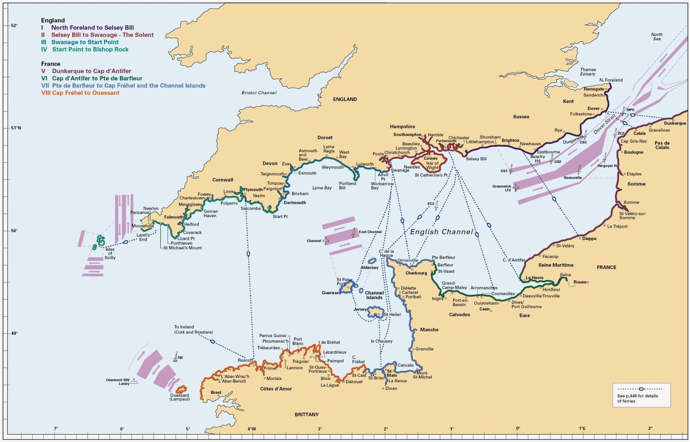

## It’s nearly time

From June 2026 I have three months free and can go sailing for that period. I am very much looking forward to being away for so long, meeting new people and discovering new places. It is still some way off, but time is moving on. It is still the end of January and it is bitterly cold outside, so the voyage feels a long way away for now.

Some things are already fixed, others are not yet. That will follow in due course.

The legs planned so far are each about 14 days long. There is the delivery passage, the cruising, and the regattas, each with a different character.

For the **delivery passage Hamburg–Lymington**, I would rather sail longer stretches and would like one or two more people on board. It goes via Heligoland, some Dutch ports, and Dover to Lymington, right in the Solent.

For the **Cruising Channel**, I would prefer shorter legs and longer stays on the Channel Islands such as Guernsey and Sark.

The **Co32 Regatta** is a weekend event with several races and, hopefully, many other Contessa 32 crews from England and perhaps the Netherlands. I would be happy to sail it in a more competitive spirit and get the best out of the boat. It should be a very pleasant event with a friendly social programme.

The **Channel Regatta** should be an interesting one. Relaxed, but still spirited sailing across the Channel, with several races along the French coast and strong tide. English and French sailors work together, so it should be rather lively.

The legs are listed under [Planning](#provisional-plan).

## Overview

- The route runs west from Hamburg into the Solent and then further west: the West Country, perhaps the Isles of Scilly, perhaps the Channel Islands such as Guernsey and Sark.

- The start and end of my 2026 sailing leave are fixed: departure is in early June, and by the end of August I want to be back home in Hamburg.
Whether [Lucy](/boat/) will be back in Hamburg too, or remain in England, is still open, which is why the options below exist.

- On the outward and return passages I would like to sail some longer legs of more than 60 nm, so we will be underway overnight at times. We sail in tidal waters, so it is best to take advantage of the tide and make sure there is enough water under the keel.

- I am looking for a friendly atmosphere on board. I would like to get to know the country and the people in England and France, and also to sail some regattas. Those will be more spirited, but always relaxed.

Some regattas are definitely part of the plan:

- The Co32 Regatta. It coincides with the “60 Years of Contessa 32” event, although what exactly will happen there is still unclear.
- The Classic Channel Regatta is attractive, but unfortunately overlaps in timing with the Round the Island (RTI) Regatta. At present, the better choice seems to be the Channel Regatta.

And naturally there should be some cruising time as well, to get to know the places and people and to take a break now and then.

## Provisional plan

Legend:
- 🤔: number of crew needed.
- 👍: number already confirmed.
- **Crew**: who is on board (+ [Karsten](/sailing)).
- Crew change: possible here, and perhaps elsewhere too. For a rough voyage plan, [Rome2Rio](https://www.rome2rio.com) is quite useful.

| **Leg**                                         | **Datum**  | **Ort**      | 🤔  | 👍 | **Crew** | **Notizen**                                                                            |
|-------------------------------------------------|:-----------|:-------------|:----|:---|----------|:---------------------------------------------------------------------------------------|
|                                                 | 2026-05-31 | Hamburg      |     |    |          | Farewell Party                                                                         |
| [Hamburg-Lymington](legs/hamburg-lymington)     | 2026-06-01 | Hamburg      | 2   | 1  | P        | Start Hamburg-Lymington: Elbe, Nordsee, Solent                                         |
|                                                 | 2026-06-15 | Lymington    |     |    |          | Crew change                                                                            |
| [Cruising-Channel](legs/cruising-channel)       | 2026-06-15 | Lymington    | 1-2 | 1  |          | Start Cruising Channel                                                                 |
|                                                 | 2026-06-25 | Yarmouth     |     |    |          | Crew change                                                                            |
| [Co32-Regatta](legs/co32-regatta)               | 2026-06-26 | Yarmouth     | 2-3 | 1  |          | Start [Co32 Regatta](#co32-regatta)                                                    |
|                                                 | 2026-06-28 | Yarmouth     | 2-3 | 1  |          | End [Co32 Regatta](#co32-regatta)                                                      |
|                                                 | 2026-07-05 | Dartmouth    | 2-3 |    |          | Crew change                                                                            |
| [Channel-Regatta](legs/classic-channel)         | 2026-07-06 | Dartmouth    | 2-3 | 2  | R        | Crew change: Start [Classic Channel Regatta](#classic-channel-regatta)                 |
|                                                 | 2026-07-16 | Paimpol      | 2-3 | 2  | R        | Ende [Classic Channel Regatta](#classic-channel-regatta)                               |
| [Paimpol-Plymouth](legs/paimpol-plymouth)       | 2026-07-18 | Plymouth     | 2-3 | 2  | R        | Arrival Plymouth                                                                       |
|                                                 | 2026-07-19 | Plymouth     |     |    |          | Crew change                                                                            |
| [Cruising-WestCountry](legs/west-country)       | 2026-07-19 | Plymouth     | 2   | 2  | B        | Start Cruising WestCountry                                                             |
|                                                 | 2026-08-16 | Southampton  |     |    |          | Crew change                                                                            |
| [Southampton-Hamburg](legs/southampton-hamburg) | 2026-08-17 | Southampton  | 2-3 |    |          | ? Return to Hamburg (if Lucy returns to Hamburg)                                       |
|                                                 | 2026-08-27 | Hamburg      | 2-3 |    |          | ? Arrival in Hamburg (if Lucy returns to Hamburg)                                      |

<!--
[Table Tools](https://felisdiligens.github.io/md-table-tools/demo/)
-->

## Map of the English Channel

## Regattas

### Classic Channel Regatta

> requires self-measured sails and a self-issued certificate

Three inshore races at Dartmouth Classics; two passage races across the Channel: the Classic Channel Race from Dartmouth to St Peter Port and the passage race from St Peter Port to Lézardrieux.

[Classic Channel Regatta](https://www.classic-channel-regatta.eu)

### Co32 Regatta

- [Co32 Regatta](https://www.co32.org/event/2026-co32-inshore-series-4)

> requires a class certificate

## Notes

### Deacons Marina

Where George [Solent Boat Butler](https://www.solentboatbutler.co.uk) might keep an eye on Lucy from August until the following year.
- [Deacons Marina](https://www.boatfolk.co.uk/deacons-marina-southampton)

### Broad route

See [here](https://www.bednblue.com/sailing-distance-calculator?cruisingSpeed=5&map=%5B%7B%22latLng%22%3A%2253.543904%2C9.855203%22%2C%22name%22%3A%2253.543904%2C%209.855203%22%7D%2C%7B%22latLng%22%3A%2253.557253%2C9.785953%22%7D%2C%7B%22latLng%22%3A%2253.564484%2C9.714642%22%7D%2C%7B%22latLng%22%3A%2253.569732%2C9.676927%22%7D%2C%7B%22latLng%22%3A%2253.579872%2C9.650198%22%7D%2C%7B%22latLng%22%3A%2253.603822%2C9.591934%22%7D%2C%7B%22latLng%22%3A%2253.615958%2C9.559076%22%7D%2C%7B%22latLng%22%3A%2253.632167%2C9.53995%22%7D%2C%7B%22latLng%22%3A%2253.706102%2C9.490713%22%7D%2C%7B%22latLng%22%3A%2253.749013%2C9.422451%22%7D%2C%7B%22latLng%22%3A%2253.827647%2C9.370669%22%7D%2C%7B%22latLng%22%3A%2253.869657%2C9.275344%22%7D%2C%7B%22latLng%22%3A%2253.884131%2C9.144314%22%7D%2C%7B%22latLng%22%3A%2253.880792%2C8.887402%22%7D%2C%7B%22latLng%22%3A%2253.867%2C8.718778%22%7D%2C%7B%22latLng%22%3A%2253.951943%2C8.698469%22%7D%2C%7B%22latLng%22%3A%2254.044522%2C8.456347%22%7D%2C%7B%22latLng%22%3A%2254.178039%2C7.91717%22%7D%2C%7B%22latLng%22%3A%2253.667931%2C6.964143%22%7D%2C%7B%22latLng%22%3A%2253.365854%2C4.956429%22%7D%2C%7B%22latLng%22%3A%2253.042897%2C4.618261%22%7D%2C%7B%22latLng%22%3A%2252.461954%2C4.477846%22%7D%2C%7B%22latLng%22%3A%2252.036527%2C4.043547%22%7D%2C%7B%22latLng%22%3A%2251.950711%2C3.88957%22%7D%2C%7B%22latLng%22%3A%2250.993975%2C1.834957%22%7D%2C%7B%22latLng%22%3A%2251.096826%2C1.350204%22%7D%2C%7B%22latLng%22%3A%2250.88452%2C1.039163%22%7D%2C%7B%22latLng%22%3A%2250.689815%2C0.266696%22%7D%2C%7B%22latLng%22%3A%2250.715448%2C-0.983676%22%7D%2C%7B%22latLng%22%3A%2250.785635%2C-1.268286%22%7D%2C%7B%22latLng%22%3A%2250.758531%2C-1.54191%22%2C%22name%22%3A%22Lymington%2C%20United%20Kingdom%22%7D%5D&consumption=1.5)

### Yachtmaster Offshore requirements

- Sea miles & days:
  - 50 days at sea, including 5 days as skipper.
  - 2,500 nautical miles, including at least 1,250 nm in tidal waters.
  - 5 passages over 60 nm, including 2 as skipper and 2 with night sailing.
