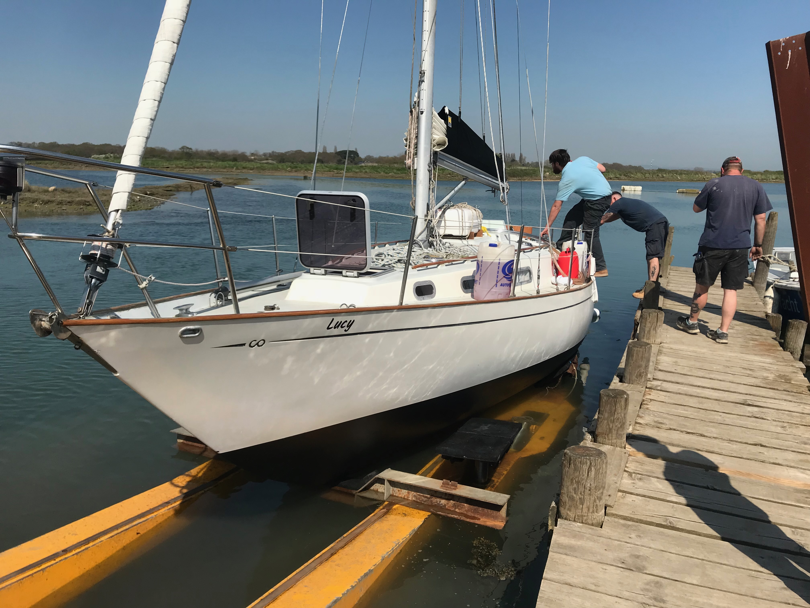
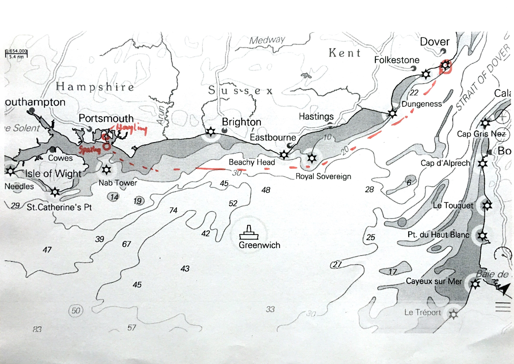
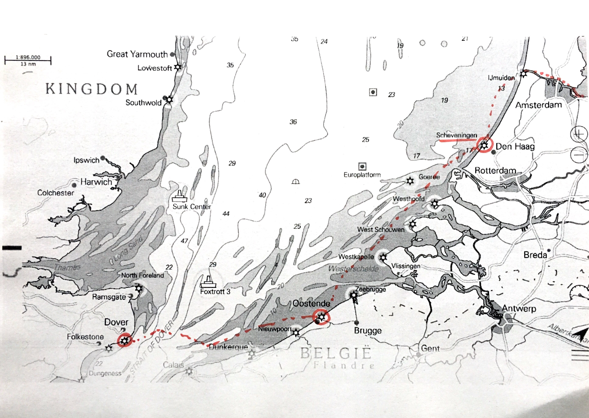
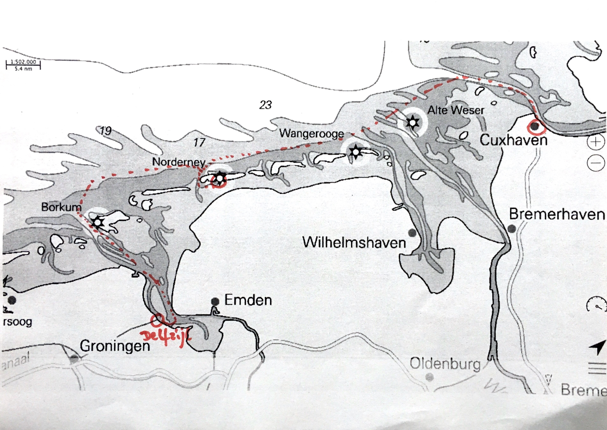

+++
date = '2018-04-20'
draft = false
title = 'Delivery from Hayling Island'
+++

Lucy was built in England and was launched for the first time in Lymington on 7 March 1979. I also purchased Lucy in England. Robin Milledge was a great help to me during the purchase, and I can highly recommend him as a surveyor! See [Rozel Marine](https://rozelmarine.co.uk).

At Hayling Island, the yard [Hayling Yacht Company](http://haylingyacht.co.uk/) carried out a refit. Structural issues were addressed and the engine was overhauled.

## Winter in the Boat Shed

I undertook some of the work myself and visited the yard several times. The yard is beautifully situated. Working in the cold boat shed was no pleasure. Most boats in England are kept outside over winter, so I was glad to be able to work indoors.

## The Journey Begins!

Then the time came: Lucy was launched and moved towards Hamburg.

*Lucy launched at Hayling Island, Red Diesel on board*

The voyage from Hayling Island to Delfzijl, followed by a two-week pause, then onwards to Hamburg.

   
