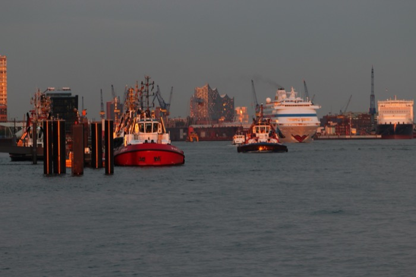
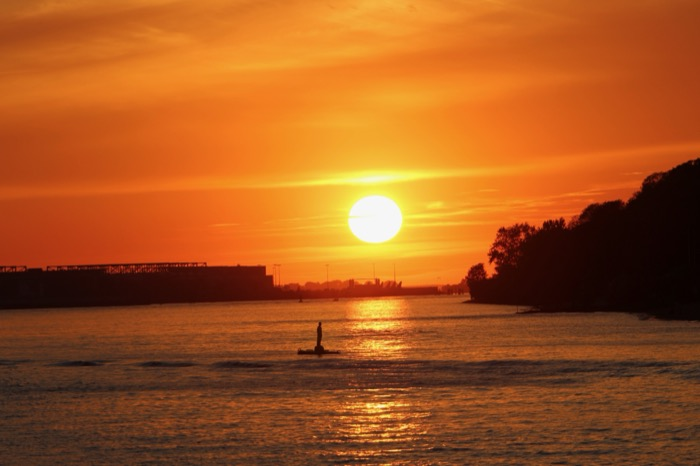

+++
date = '2025-05-07T19:48:46+02:00'
draft = false
title = 'Segeln auf der Elbe'
+++

*Segeln auf der Elbe*

Elbe, das heißt [Tide](https://en.wikipedia.org/wiki/Tide). Also Segeln im Strom, am besten mit dem Strom 😉

Der Heimathafen von Lucy ist Hamburg. Hamburg liegt an der Elbe und das Segeln beginnt direkt vor der Hafeneinfahrt. In meinem Fall die Einfahrt des Hafens Rüschkanal auf Finkenwerder.

Die Elbe ist ein Tidenrevier, die Strömung geht als nicht immer flussabwärts sondern dank der Flut auch mal flussaufwärts. Um Spaß zu haben und voranzukommen richtet man sich tunlichts nach der Tide. Die bestimmt den Takt und die Zeitpunkte fürs Ablegen und Anlegen.

*Blick auf de Elbphilharmonie*

*Hafen Rüschkanal*

Zum Übernachten finden Sie am Rüschkanal einen ruhigen Gästeliegeplatz, an dem Sie Ihre Boote mit Frischwasser und Strom versorgen können. Siehe [Gästeinformation](https://svfh.de/gaeste-info/)

*Abendstimmung Övelgönne*

Siehe auch [Segeln auf der Elbe ist toll … aber nichts für mich
](https://elbgaengerin.wordpress.com/2017/05/30/segeln-auf-der-elbe-ist-toll-aber-nichts-fuer-mich/)
