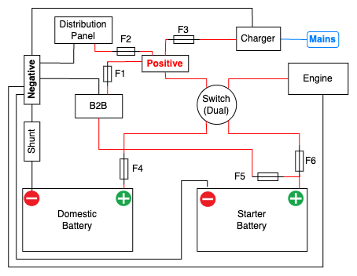

## Batterieverkabelung

Du möchtest deine Batterieverkabelung so einfach und robust wie möglich gestalten. Für viele Menschen ist Batterieverkabelung wie schwarze Magie – aber George kam zur Rettung 😉

George hat die Grundlagen sehr gut erklärt – welche Komponenten du brauchst und wie du sie anschließt. Sieh selbst im untenstehenden YouTube-Video.

George stellt ein einfaches Verdrahtungsschema vor, das ich in eine Zeichnung umgesetzt habe. Hier ist sie:

Wenn du die Zeichnung anpassen möchtest, öffne die Datei einfach in [draw.io](https://app.diagrams.net/?src=about#Uhttps%3A%2F%2Flucy.hamburg%2Fposts%2Fwiring%2Fwiring.drawio#%7B%22pageId%22%3A%22UcFnGM5fcW15tLSDESSC%22%7D) oder lade sie [hier](wiring.drawio) herunter.

Sieh dir „Raceboat Refit – Battery Upgrade & Supporting Mods – Step-By-Step“ unten an und abonniere [hier](https://www.youtube.com/@RefitandSail) den großartigen RefitandSail-Kanal von George Isted.


